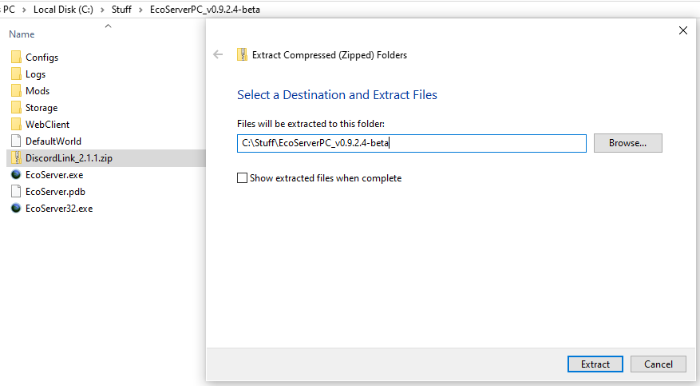
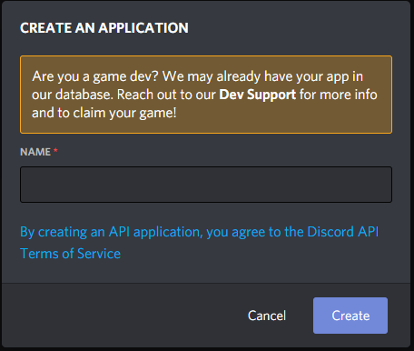

# How to install the DiscordLink plugin on your Eco Server.

Note: If you do _*not*_ have access to the server GUI, copy the config file from the _"ExampleConfig"_ folder and fill in the values directly in the file. Documentation for doing this can be found in the [configuration guide](ConfigurationNoGUI.md).

### 1. Download the latest DiscordLink release .zip file from <https://github.com/Spoffy/EcoDiscordPlugin/releases>

### 2. Go to your server's mods folder (Eco Server/Mods/) and extract the .zip there and start your server.

### 3. When the server has loaded, navigate to the DiscordLink configuration tab. You'll see a configuration box labelled "BotToken". We need to go create one.

### 4. Navigate to <https://discordapp.com/developers/applications/me>. Login to Discord and click "New App".

### 5. Name your bot appropriately (this will be the bot's name on your Discord server).

### 6. Click the section labelled "Bot". Click "Create a Bot User".

### 7. Click "Add Bot"

### 8. This section will now contain the token we need. Click the copy button to get the token into your clipboard.

### 9. Paste the token into the "BotToken" section of the server GUI. If you check the server's console, you should see "Connected to Discord". If you don't, double check your token.

### 10. Navigate back to the bot's page on the Discord website (see above). Copy the "Client ID" that appears at the top - you will need it in the next section.

### 11. Go to <https://discordapi.com/permissions.html#216064>. Paste the Client ID in the bottom left field labelled "Client ID", and add any extra permissions you want the bot to have. Click the link at the bottom.

### 12. Set the server you want to invite the bot to, then click "Continue".

### 13. Check your Discord server to see that the bot is online when the server is running.
**Offline**

**Online**

### 14 Set up a [Chat Channel Link](ConfigurationGUI.md)

### 15 Run the _"Echo"_ command in the Discord channel specified in the Chat Channel Link to see that it is working properly. Make sure that the bot has permissions to send messages.

**Echo command**

**Discord server GUI chat display showing that the message reached the Eco server**

**Discord bot crosspost if a [Channel Link](ConfigurationGUI.md) has been set up**

### 16. You're done! [Configure](ConfigurationGUI.md) any other options you want in server GUI, or change the Bot's permissions as if they're any other user in Discord.
