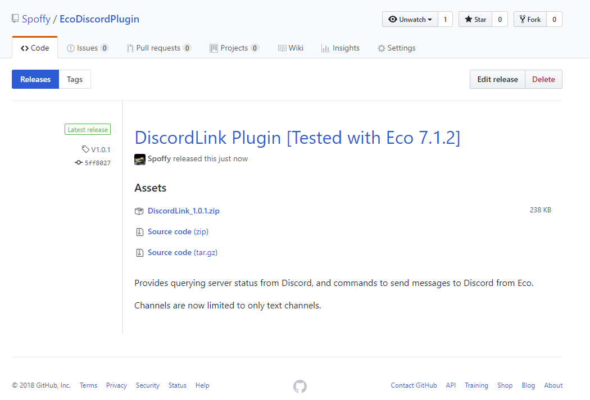
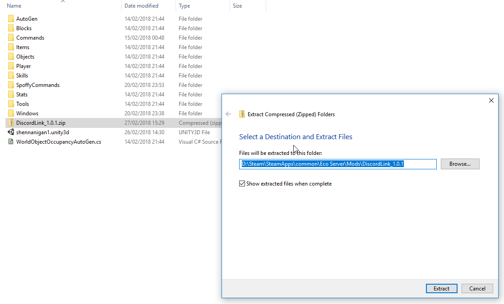

# How to install the DiscordLink plugin on your Eco Server.

Note: If you do *not* have access to the server's GUI, copy the config file from the ExampleConfig folder and fill in the values directly in the file.

### 1. Download the latest DiscordLink release .zip file from <https://github.com/Spoffy/EcoDiscordPlugin/releases>

### 2. Go to your server's mods folder (Eco Server/Mods/) and extract the .zip there.

### 3. When the server has loaded, navigate to the DiscordLink configuration tab. You'll see a configuration box labelled "BotToken". We need to go create one.

### 4. Navigate to <https://discordapp.com/developers/applications/me> . Login to Discord and click "New App".

### 5. Name your bot appropriately (this will be the bot's name on your Discord server). Add a description if you fancy.

### 6. Scroll down to the section labelled "Bot". Click "Create a Bot User".

### 7. This section will now contain the token we need. Click to reveal the token (if necessary), then copy the token.

### 8. Copy the token into the "BotToken" section of the server GUI. If you check the server's console, you should see "Connected to Discord". If you don't, double check your token.

### 9. Navigate back to the bot's page on the Discord website (see above). Copy the "Client ID" that appears at the top - you'll need it in the next section.

### 10. Go to <https://discordapi.com/permissions.html#216064> . Paste the Client ID in the bottom left field labelled "Client ID", and add any extra permissions you want the bot to have. Click the link at the bottom.

### 11. Set the server you want to invite the bot to, then click "Authorize".

### 12. You're done! Configure any other options you want in server GUI, or change the Bot's permissions as if they're any other user in Discord.
